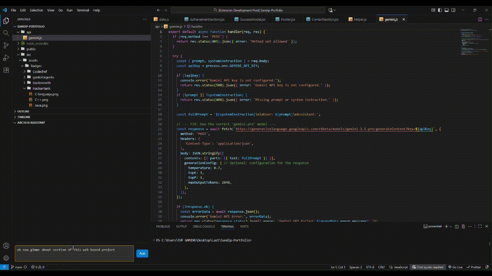

# Arc1610: Your Local Codebase AI Assistant

**Arc1610** is a Private Visual Studio Code extension that acts as a local, private, and powerful AI assistant with deep knowledge of your entire codebase. Using a local LLM (via Ollama) and a RAG (Retrieval-Augmented Generation) pipeline, it allows you to ask complex questions about your project's logic, structure, and implementation in plain English.

Because everything runs on your machine, your code remains **100% private**.

# Is this a full replacement for Copilot? — Partially, yes.


> 


---

##  Core Features

*   **Chat With Your Codebase**: Ask questions about how different parts of your code work, and get answers based on the actual source files.
*   **Completely Local & Private**: Your code and your questions never leave your machine.
*   **Streaming Responses**: The AI's answers are typed out in real-time for a responsive, modern chat experience.
*   **Markdown & Code Highlighting**: Responses are beautifully formatted, with full syntax highlighting for code snippets.
*   **Theme-Aware UI**: The chat interface automatically adapts to your current VS Code theme.

##  How It Works

Arc1610 uses a RAG pipeline to provide context-aware answers.

1.  **Indexing**: A Python script (`run.py`) walks through your project directory, splits your code files into intelligent chunks, and uses an embedding model (all-MiniLm-L6-v2 : Faster and lightweight) to convert them into vectors. These vectors are stored locally in a high-performance FAISS vector database. 
2.  **Querying**: When you ask a question in the VS Code extension, it's sent to a local FastAPI server. The server converts your question into a vector and uses the FAISS database to find the most relevant chunks of code from your project.
3.  **Generation**: The relevant code chunks (the context) and your original question are passed to a local LLM (like Mistral via Ollama). The LLM then generates a comprehensive answer based *only* on the provided context.


## System Requirements

### Hardware

Running Large Language Models locally is resource-intensive. For a smooth experience, the following is recommended:

| Component | Minimum | Recommended |
| :--- | :--- | :--- |
| **RAM** | 16 GB | 32 GB or more |
| **GPU** | Not required (CPU-only works) | NVIDIA (8GB+ VRAM) or Apple Silicon |
| **Storage** | 10 GB free space | 25 GB+ free space (for models & indexes) |

*A dedicated GPU will significantly accelerate model inference speeds.*

### Software

1.  **Ollama**: The engine for running the local LLM.
    -   [Download Ollama here](https://ollama.com/).
    -   After installing, pull the `mistral` model:
        ```bash
        ollama run mistral
        ```

2.  **Node.js & npm**: Required to build and run the VS Code extension.
    -   [Download Node.js here](https://nodejs.org/) (v18 or higher recommended).

3.  **Python**: Version 3.8 or higher.
    -   Install all required Python libraries with one command:
        ```bash
        python.exe -m pip install -r requirements.txt
        ```


##  Getting Started

Follow these steps to get Arc1610 running.

### Step 1: Index Your Codebase

First, you need to create the vector database for the project you want to ask questions about.

Run the `run.py` script from your terminal, passing the path to the codebase you want to index.

```bash
# Example:
python run.py /path/to/your/project
```
This will create a `faiss_index` folder in your project directory. You only need to do this once per codebase (or whenever you want to update the index with major changes).

### Step 2: Frontend (VS Code Extension) Setup


1.  **Navigate to the Extension Folder**: Open your terminal inside the `Arc1610-Extension` folder (the one containing `package.json`).
    ```bash
    cd Arc1610-Extension
    ```
2.  **Install Dependencies**: This will download all the necessary libraries for the extension.
    ```bash
    npm install
    ```
3.  **Compile the Code**: This will compile the TypeScript code into JavaScript that VS Code can run.
    ```bash
    npm run compile
    ```
### Step 3: Launch the Application


1.  **Start the Backend Server**: In your terminal (from the project root, not the `Arc1610-Extension` folder), start the FastAPI server. Keep this terminal running.
    ```bash
    uvicorn api:app --reload
    ```

2.  **Launch the Extension**:
    -   Open the `Arc1610-Extension`  folder in a separate VS Code window.
    -   Press **F5** to start the debugger. This will open a new "Extension Development Host" window.
    -   In the new window, you can see new section named as Arc1610 in Explorer section .
    -   Start asking questions about the codebase you indexed!

---


### Known Issues
*   The backend server must be started and stopped manually.
*   The index is not updated automatically; you must re-run `run.py` to index new code changes.
*   16GB RAM machine is require for smooth experice (since running local LLMs).

### Future Features

*    **Chat History**: Allow for follow-up questions by providing conversation context.
*    **"Stop Generating" Button**: Give users the ability to cancel an in-progress response.
*    **Automatic Re-indexing**: Watch for file changes and automatically update the vector index.
*   **Configuration Settings**: Allow users to change the model, index path, etc., from VS Code settings.
*   **Publication**: Will release soon...

### Metrics
1.  Local First & Private- Your Codebase is just yours no third party API calling.
2.  Truly Free & Open Source- No subscriptions, no API keys, no hidden costs. Just your mind and machine.
3.  Fully Extensible- Have a Beast machine? Use advanced utilities like superior LLMs(e.g. Qwen-32b etc.), sentence transformers models, and vector models.
4. No limitation, No quota exceeding anymore.


